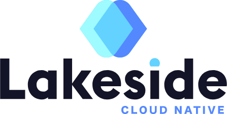

  

# Who we are?

Tech agency trusted by impact leaders.

# What we do?

We build mission-critical solutions for education, health and environment. Our clients are social impact startups, charities and public institutions.

### Mobile applications

Our app development journey begins with a deep-dive into your ideas and impact objectives. We perform user-research and analyse the core requirements for your mobile app. You work with our mobile designer to produce high-fidelity wireframes that show the look, feel and function of your future app.
‍
Our mobile app development portfolio includes mobile apps designed for public institutions, NGOs and startups. Our latest releases to the AppStore support people recovering from mental illness and help patients in primary care access public health services. We also develop award-winning educational apps used to deliver safety-training to public schools.

### Custom web applications

We create custom software solutions and platforms that power modern data-driven businesses and NGOs. Our web apps are designed to fit your processes and produce insightful reports out of the box.

Our seasoned delivery team is experienced at modelling even the most complex business processes and our battle-tested enterprise platform delivers security, scaling and compliance out of the box.

Our clients include charities, NGOs, health-tech providers and carbon-curbing re-commerce sites.

# How we do it?

### Friendly, collaborative process

Software development is an inherently human activity. We understand your team's mission to solve real-world problems. Communication, trust and accountability are our tools of trade and we love working with likeminded people.

### Weekly project meeting

Regular face-time with the team makes the entire process transparent and more pleasurable. While software development is never effortless, it doesn't have to be stressful either. The weekly project meeting 30min fosters collaboration and puts our clients at the centre of our creative process.

### High fidelity UI wireframes

Before we write a single line of code we spend time iterating with you on the solution architecture. Our design team mocks up high-fidelity wireframes to reflect our understanding of your requirements and propose solutions that get the job done and easy to use.

We use high-fidelity wireframes to collaborate on improvements and action your feedback. Wireframes are also a great way to involve other stakeholders in your organisation and engage with your users.

### Fixed budget contracts

Many of our clients are publicly funded and don't have any room to go over budget. Being able to accurately estimate development projects is somewhat of a vanishing art. We are proud to offer this service to our clients and will double on our estimates by accepting fee-caps as part of contract negotiation.

# Technical Advisory

If your technical team needs additional support we may be able to help by acting as board advisors. We help guarantee that your team is always working on the most important problems. We help you plan and monitor your strategy and roadmaps and advise on tactical decisions like architecture and recruitment. Our advisors are C-Level professionals with proven track records.

When your team becomes stretched, we can also help deliver research, solution architecture and ops automation. Our consultants have decades of experience in software and system design and have built systems which scale to millions of transactions per day.

# Projects overview

Check out the project we are proudest of [here](https://www.lakesidernd.com/projects).

# Join us!

If you want to join us, take a look at the [open positions](https://www.lakesidernd.com/careers).
